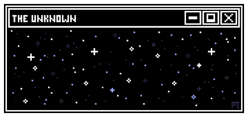
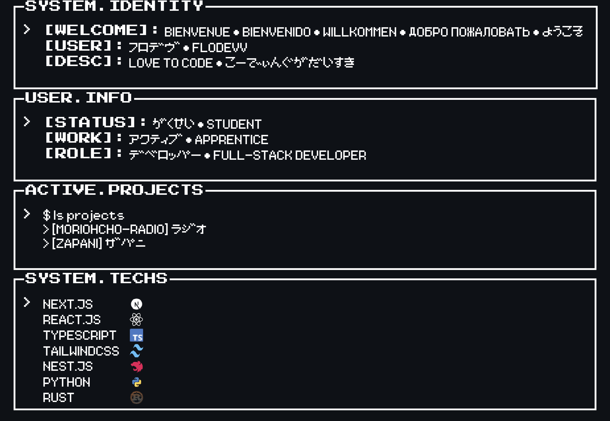

  
  

<picture>
  <source media="(prefers-color-scheme: light)" srcset="image/dark/all.png">
  <source media="(prefers-color-scheme: dark)" srcset="image/dark/all.png">
  
</picture>
 
<picture>
  <source media="(prefers-color-scheme: light)" srcset="https://pixel-profile-ui.vercel.app/api/github-stats?username=FloDevv&include_all_commits=true&pixelate_avatar=true&background=linear-gradient%280deg%2C+%23ffffff+0%25%2C+%23ffffff+100%25%29&color=%23000000">
  <source media="(prefers-color-scheme: dark)" srcset="https://pixel-profile-ui.vercel.app/api/github-stats?username=FloDevv&include_all_commits=true&pixelate_avatar=true&background=linear-gradient%280deg%2C+%230d1116FF+0%25%2C+%230d1116FF+100%25%29&color=%23ffffff">
  
</picture>
