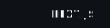

<table style="border: none; width: 100%">
<tr><td align="center" style="border: none;">
フロデヴ • FLODEVV 
[SYSTEM]: WELCOME !
</td></tr>
</table>

`[ ABOUT ME ]`

<table>
<tr><td>
STATUS: STUDENT  
WORK: YES  
ROLE: FULL-STACK DEVELOPER
</td></tr>
</table>

`[ CURRENT PROJECTS ]`

<picture>
  <source media="(prefers-color-scheme: light)" srcset="https://img.shields.io/static/v1?message=MoriohCho-Radio&logo=github&label=&color=ffffff&logoColor=000000&labelColor=ffffff&style=for-the-badge">
  <source media="(prefers-color-scheme: dark)" srcset="https://img.shields.io/static/v1?message=MoriohCho-Radio&logo=github&label=&color=0d1116&logoColor=ffffff&labelColor=0d1116&style=for-the-badge">
  
</picture>
<picture>
  <source media="(prefers-color-scheme: light)" srcset="https://img.shields.io/static/v1?message=ZAPANI&logo=github&label=&color=ffffff&logoColor=000000&labelColor=ffffff&style=for-the-badge">
  <source media="(prefers-color-scheme: dark)" srcset="https://img.shields.io/static/v1?message=ZAPANI&logo=github&label=&color=0d1116&logoColor=ffffff&labelColor=0d1116&style=for-the-badge">
  
</picture>

`[ MAIN TECHS ]`

<table style="border: none; background: none; width: 100%;">
<tr style="border: none; background: none;">
<td style="border: none; width: 40%; vertical-align: top;">

<picture>
  <source media="(prefers-color-scheme: light)" srcset="./svg/light/nextjs.svg">
  <source media="(prefers-color-scheme: dark)" srcset="./svg/dark/nextjs.svg">
  
</picture>
<picture>
  <source media="(prefers-color-scheme: light)" srcset="https://img.shields.io/badge/React-ffffff?style=for-the-badge&logo=react&logoColor=000000&labelColor=ffffff">
  <source media="(prefers-color-scheme: dark)" srcset="https://img.shields.io/badge/React-0d1116?style=for-the-badge&logo=react&logoColor=white&labelColor=0d1116">
  
</picture>
<picture>
  <source media="(prefers-color-scheme: light)" srcset="https://img.shields.io/badge/TypeScript-ffffff?style=for-the-badge&logo=typescript&logoColor=000000&labelColor=ffffff">
  <source media="(prefers-color-scheme: dark)" srcset="https://img.shields.io/badge/TypeScript-0d1116?style=for-the-badge&logo=typescript&logoColor=white&labelColor=0d1116">
  
</picture>
<picture>
  <source media="(prefers-color-scheme: light)" srcset="https://img.shields.io/badge/Tailwind%20CSS-ffffff?style=for-the-badge&logo=tailwind-css&logoColor=000000&labelColor=ffffff">
  <source media="(prefers-color-scheme: dark)" srcset="https://img.shields.io/badge/Tailwind%20CSS-0d1116?style=for-the-badge&logo=tailwind-css&logoColor=white&labelColor=0d1116">
  
</picture>
<picture>
  <source media="(prefers-color-scheme: light)" srcset="https://img.shields.io/badge/NestJS-ffffff?style=for-the-badge&logo=nestjs&logoColor=000000&labelColor=ffffff">
  <source media="(prefers-color-scheme: dark)" srcset="https://img.shields.io/badge/NestJS-0d1116?style=for-the-badge&logo=nestjs&logoColor=white&labelColor=0d1116">
  
</picture>
<picture>
  <source media="(prefers-color-scheme: light)" srcset="https://img.shields.io/badge/Python-ffffff?style=for-the-badge&logo=python&logoColor=000000&labelColor=ffffff">
  <source media="(prefers-color-scheme: dark)" srcset="https://img.shields.io/badge/Python-0d1116?style=for-the-badge&logo=python&logoColor=white&labelColor=0d1116">
  
</picture>
<picture>
  <source media="(prefers-color-scheme: light)" srcset="https://img.shields.io/badge/Rust-ffffff?style=for-the-badge&logo=rust&logoColor=000000&labelColor=ffffff">
  <source media="(prefers-color-scheme: dark)" srcset="https://img.shields.io/badge/Rust-0d1116?style=for-the-badge&logo=rust&logoColor=white&labelColor=0d1116">
  
</picture>

</td>
<td style="border: none; width: 60%; vertical-align: top;">

<picture>
  <source media="(prefers-color-scheme: light)" srcset="https://github-readme-stats.vercel.app/api/top-langs/?username=FloDevv&layout=compact&theme=light&bg_color=ffffff&title_color=000000&text_color=000000&icon_color=000000&border_color=000000&border_radius=6">
  <source media="(prefers-color-scheme: dark)" srcset="https://github-readme-stats.vercel.app/api/top-langs/?username=FloDevv&layout=compact&theme=dark&bg_color=0d1116&title_color=ffffff&text_color=ffffff&icon_color=ffffff&border_color=21262d&border_radius=6">
  
</picture>

</td>
</tr>
</table>

`[ SYSTEM METRICS ]`

<picture>
  <source media="(prefers-color-scheme: light)" srcset="https://pixel-profile-ui.vercel.app/api/github-stats?username=FloDevv&include_all_commits=true&pixelate_avatar=true&background=linear-gradient%280deg%2C+%23ffffff+0%25%2C+%23ffffff+100%25%29&color=%23000000&screen_effect=true">
  <source media="(prefers-color-scheme: dark)" srcset="https://pixel-profile-ui.vercel.app/api/github-stats?username=FloDevv&include_all_commits=true&pixelate_avatar=true&background=linear-gradient%280deg%2C+%230d1116+0%25%2C+%230d1116+100%25%29&color=%23ffffff&screen_effect=true">
  
</picture>
